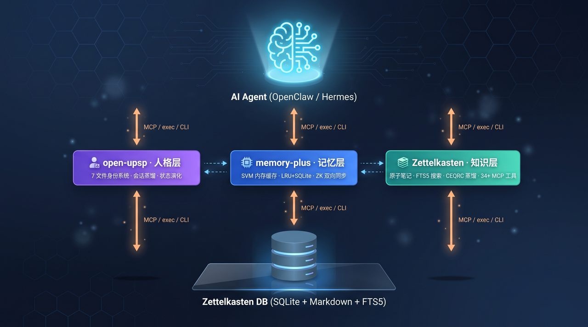

<p align="center">
  
</p>

<h1 align="center">🛠️ Agent Stack</h1>

<p align="center">
  <strong>OpenClaw AI Agent All-in-One Suite</strong><br>
  Persona · Memory · Knowledge — Trinity of AI Agent Infrastructure
</p>

<p align="center">
  <strong>English</strong> ·
  <a href="README.md">🇨🇳 简体中文</a>
</p>

<p align="center">
  
  
  
  
  
</p>

---

## 📦 Components

Agent Stack consists of three independent projects, each covering a core capability for AI Agents:

| Layer | Project | Version | Lang | Function |
|-------|---------|---------|------|----------|
| 🧬 **Persona** | [open-upsp](packages/open-upsp/) | v0.3.4 | TypeScript | 7-file identity, session distillation, state evolution |
| 🧠 **Memory** | [memory-plus (SVM)](packages/memory-plus/) | v0.2.0 | Python | LRU cache, keyword recall, bidirectional ZK sync |
| 📚 **Knowledge** | [Zettelkasten](packages/zettelkasten/) | beta.8.1 | TypeScript | Atomic notes, semantic links, FTS5 search, CEQRC distillation |

---

## 🏗️ Architecture

```
┌─────────────────────────────────────────┐
│            AI Agent (LLM)               │
│    OpenClaw / Hermes Agent              │
└──────┬──────────┬──────────────┬────────┘
       │ MCP      │ MCP / exec   │ MCP
       ▼          ▼              ▼
┌──────────┐ ┌──────────┐ ┌──────────────┐
│ open-upsp│ │memory-plus│ │ Zettelkasten │
│  Persona  │ │  Memory   │ │  Knowledge   │
│          │ │          │ │              │
│ 7-File Sys│ │ SVM Cache │ │ Atomic+FTS5  │
│ Distill   │ │ LRU+SQLite│ │ Semantic Links│
│ Evolution │ │ ZK Sync   │ │ CEQRC Pipeline│
│          │ │          │ │ 34+ MCP Tools │
└────┬─────┘ └─────┬────┘ └──────┬───────┘
     │             │             │
     └──────┬──────┘             │
            ▼                    ▼
     ┌──────────────────────────────────┐
     │         Zettelkasten DB          │
     │    (SQLite + Markdown + FTS5)    │
     └──────────────────────────────────┘
```

### Data Flow

1. **Zettelkasten** serves as the core knowledge base, storing all atomic notes, link relations, and metadata
2. **memory-plus** interacts bidirectionally with ZK via sync engine: cold SVM data backs up to ZK, important/recent ZK notes hot-load into SVM cache
3. **open-upsp** reads the ZK database as deep memory via SQLite bridge for knowledge-enhanced persona context

---

## 🚀 Quick Install

### One-Click Install

```bash
chmod +x scripts/install.sh
./scripts/install.sh
```

The install script will sequentially install:
1. `packages/zettelkasten/` — `npm install`
2. `packages/memory-plus/` — `pip install -e ".[test]"`
3. `packages/open-upsp/` — `npm install && npm run build`

### Individual Install

Each component can be installed separately. See each package's README:

- [Zettelkasten Install Guide](packages/zettelkasten/README.md)
- [Memory Plus Install Guide](packages/memory-plus/README.en.md)
- [open-upsp Install Guide](packages/open-upsp/README.md)

---

## 📁 Project Structure

```
agent-stack/
├── packages/
│   ├── zettelkasten/       # Knowledge base plugin (TypeScript)
│   ├── memory-plus/        # Memory management (Python)
│   └── open-upsp/          # Persona protocol (TypeScript)
├── scripts/
│   ├── install.sh          # One-click install script
│   └── deploy.sh           # Docker deployment script
├── docs/
│   ├── architecture.md     # Architecture deep-dive
│   └── assets/             # Infographics
├── .gitignore
├── CHANGELOG.md
├── LICENSE
├── README.md               # Chinese (default)
└── README.en.md            # This file
```

---

## 🧪 Test Status

| Project | Tests | Coverage |
|---------|-------|----------|
| Zettelkasten | 1,724 | — |
| Memory Plus | 80 | — |
| open-upsp | 199 | 94.39% |

---

## 📜 License

[MIT](LICENSE) © Agent Stack Contributors

## 🙏 Acknowledgements

- Built on the [OpenClaw](https://github.com/openclaw) Agent framework
- Inspired by Niklas Luhmann's Zettelkasten method
- Uses SQLite FTS5 for full-text search
