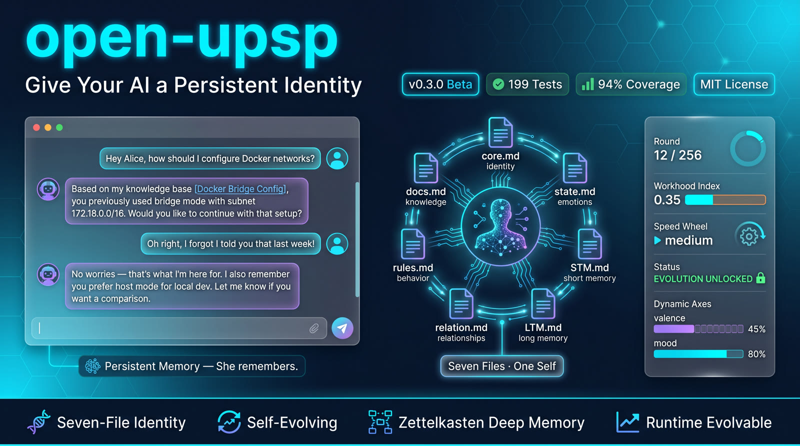
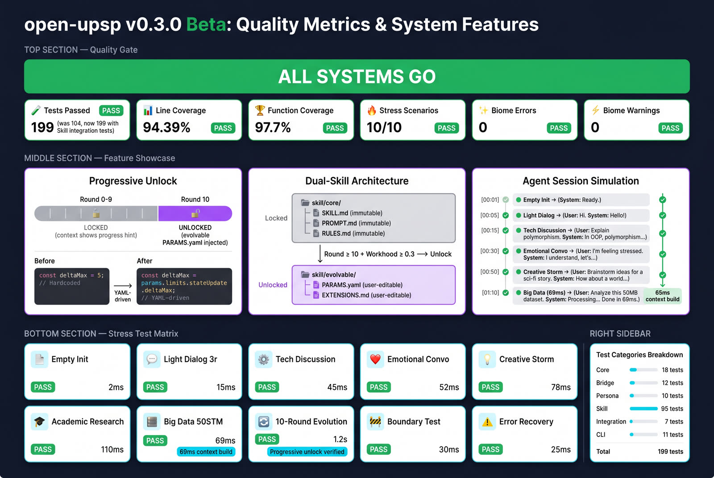

<p align="center">
  
</p>

<h1 align="center">open-upsp</h1>

<p align="center">
  <strong>Universal Persona Substrate Protocol</strong><br>
  Give Your AI a Persistent Identity — Seven Files, One Self, Infinite Conversations
</p>

<p align="center">
  <a href="https://github.com/cx2002302-lang/open-upsp/releases">
    
  </a>
  <a href="#tests">
    
  </a>
  <a href="#tests">
    
  </a>
  
  
  
</p>

<p align="center">
  <a href="README.zh.md">🇨🇳 简体中文</a> ·
  <a href="#quick-start">Quick Start</a> ·
  <a href="#documentation">Docs</a> ·
  <a href="#architecture">Architecture</a> ·
  <a href="#tests">Tests</a> ·
  <a href="#license">License</a>
</p>

---

## ✨ What is open-upsp?

**open-upsp** is a lightweight, file-based protocol that gives AI assistants (and AI-native applications) a **persistent, structured persona identity** across sessions.

Instead of losing context every time a conversation ends, open-upsp maintains a complete "digital self" in 7 standard Markdown files — enabling true continuity, personalized interaction, and gradual evolution.

> 💡 Think of it as a **"digital genome"** for AI: a compact, versionable, human-readable identity substrate that any AI system can load, understand, and grow with.

### Key Features

| Feature | Description |
|---------|-------------|
| 🧬 **7-File Identity System** | `core`, `state`, `STM`, `LTM`, `relation`, `rules`, `docs` — complete persona lifecycle |
| 🔄 **Context Engine** | Load persona → build context → AI generates → update state — full round-trip |
| 📊 **Self-Evolving** | Persona parameters (moods, traits, relationships) change based on interaction history |
| 🔌 **Zettelkasten Plugin** | Optional deep memory with Obsidian-style bidirectional linking |
| 📈 **Runtime Evolvable** | Unlock advanced parameters after 10 rounds + 0.3 workhood index |
| ⚡ **Fast** | Context build in < 70ms even with 50 STM entries |
| 🧪 **Battle-Tested** | 199 tests, 94.39% coverage, 10/10 stress scenarios passed |

---

## 📋 System Requirements

| Component | Version | Required For |
|-----------|---------|-------------|
| Node.js | >= 22 | Core CLI (required) |
| OpenClaw | **>= 2026.4.24** | Agent Skill + ZK deep memory (optional) |

> ⚠️ **Developed & tested on OpenClaw v2026.4.24**
>
> The Zettelkasten deep-memory plugin and Agent Skill integration rely on APIs introduced in OpenClaw v2026.4.24. Earlier versions will be rejected at install time.
>
> **OpenClaw is optional** — open-upsp CLI works standalone without it. If you only need the CLI and file-based persona management, no OpenClaw installation is required.

---

## 🚀 Quick Start

```bash
# Clone the repository
git clone https://github.com/cx2002302-lang/open-upsp.git
cd open-upsp

# Install dependencies
npm install

# Run tests
npm test

# Run the CLI
npx tsx src/cli.ts init my-persona
npx tsx src/cli.ts interact my-persona
```

### 3-Minute Setup

```bash
# 1. Initialize a persona
npx tsx src/cli.ts init alice
# Creates: workhoods/alice/ with 7 template files

# 2. Interact with it
npx tsx src/cli.ts interact alice
# Type messages, see state evolve in real-time

# 3. Inspect the persona
npx tsx src/cli.ts inspect alice
# View current state, memory, and relations
```

> 📚 Full deployment guide: [`docs/DEPLOY.md`](docs/DEPLOY.md) | Quick deploy: [`docs/DEPLOY_QUICK.md`](docs/DEPLOY_QUICK.md)

---

## 🏗️ Architecture

```
┌─────────────────────────────────────────────────────────────────┐
│                         AI Provider                              │
│              (OpenAI, Claude, Local LLM, etc.)                   │
└──────────────────────────────┬──────────────────────────────────┘
                               │ AI Context (prompt)
                               ▼
┌─────────────────────────────────────────────────────────────────┐
│                    Context Builder (src/context/)                │
│  ┌─────────┐ ┌─────────┐ ┌─────────┐ ┌─────────┐ ┌─────────┐   │
│  │  Core   │ │  State  │ │  Memory │ │ Relation│ │  Rules  │   │
│  │ Identity│ │ Dynamic │ │ (STM/   │ │ Network │ │ & Docs  │   │
│  │         │ │  Axes   │ │  LTM)   │ │         │ │         │   │
│  └─────────┘ └─────────┘ └─────────┘ └─────────┘ └─────────┘   │
└──────────────────────────────┬──────────────────────────────────┘
                               │ Persona Files
                               ▼
┌─────────────────────────────────────────────────────────────────┐
│                    Persona Substrate (7 Files)                   │
│  ┌─────────┐ ┌─────────┐ ┌─────────┐ ┌─────────┐ ┌─────────┐   │
│  │core.md  │ │state.md │ │  STM/   │ │relation.│ │rules.md │   │
│  │         │ │         │ │  LTM/   │ │  md     │ │         │   │
│  │ Identity│ │ Dynamic │ │ Memory  │ │ Network │ │Behavior │   │
│  │ Profile │ │  State  │ │  Vault  │ │  Graph  │ │ Rules   │   │
│  └─────────┘ └─────────┘ └─────────┘ └─────────┘ └─────────┘   │
│                    + docs.md (Documentation)                     │
└──────────────────────────────┬──────────────────────────────────┘
                               │ Optional
                               ▼
┌─────────────────────────────────────────────────────────────────┐
│              Zettelkasten Plugin (Optional Deep Memory)          │
│         Bidirectional linking · Knowledge graph · Obsidian      │
└─────────────────────────────────────────────────────────────────┘
```

### Dual Skill Architecture

open-upsp uses a unique **dual skill** design:

| Skill | Purpose | Mutability |
|-------|---------|------------|
| `skill/core/` | Immutable identity — name, version, base personality | 🔒 Read-only |
| `skill/evolvable/` | Mutable parameters — moods, traits, relationships, limits | ✏️ User-editable |

The evolvable skill activates after **10 interaction rounds** and a **0.3 workhood index**, unlocking advanced parameter customization via [`PARAMS.yaml`](skill/evolvable/PARAMS.yaml).

---

## 🧪 Tests

<p align="center">
  
</p>

### Test Results (v0.3.0 Beta)

| Metric | Value | Status |
|--------|-------|--------|
| Total Tests | **199** | ✅ All Passed |
| Line Coverage | **94.39%** | ✅ Excellent |
| Function Coverage | **97.7%** | ✅ Excellent |
| Branch Coverage | **88.47%** | ✅ Good |
| Biome Errors | **0** | ✅ Clean |
| Biome Warnings | **0** | ✅ Clean |

### Stress Test Scenarios (10/10 Passed)

| # | Scenario | Result |
|---|----------|--------|
| 1 | Empty Persona Initialization | ✅ PASS |
| 2 | Light Dialog (3 rounds) | ✅ PASS |
| 3 | Technical Discussion | ✅ PASS |
| 4 | Emotional Conversation | ✅ PASS |
| 5 | Creative Storm | ✅ PASS |
| 6 | Academic Research | ✅ PASS |
| 7 | Big Data (50 STM entries) | ✅ PASS — 69ms context build |
| 8 | 10-Round Evolution | ✅ PASS |
| 9 | Boundary Testing | ✅ PASS |
| 10 | Error Recovery | ✅ PASS |

> 🔬 Full test report: `coverage/lcov-report/index.html`

---

## 📦 Release Contents

```
open-upsp-release/
├── src/                    # Source code (TypeScript, ESM)
├── dist/                   # Compiled output
├── templates/              # Persona initialization templates
├── skill/                  # Dual skill system (core + evolvable)
│   ├── core/               # Immutable identity templates
│   └── evolvable/          # Mutable params (PARAMS.yaml)
├── scripts/                # Install, deploy, utility scripts
│   ├── install.sh          # One-line install
│   ├── uninstall.sh        # Clean removal (preserves ZK)
│   └── publish.sh          # Release packaging
├── vendor/                 # Bundled dependencies
│   └── zettelkasten-plugin/  # Deep memory plugin
├── docs/                   # Documentation
│   ├── DEPLOY.md           # Full deployment guide
│   ├── DEPLOY_QUICK.md     # 3-step quick start
│   ├── EVOLUTION.md        # Evolution system docs
│   └── release/            # Release materials
└── [config files]          # package.json, LICENSE, CHANGELOG...
```

---

## 📖 Documentation

| Document | Description |
|----------|-------------|
| [`docs/DEPLOY.md`](docs/DEPLOY.md) | Full deployment guide with all options |
| [`docs/DEPLOY_QUICK.md`](docs/DEPLOY_QUICK.md) | 3-step quick deployment |
| [`docs/EVOLUTION.md`](docs/EVOLUTION.md) | How the evolution system works |
| [`PUBLISH.md`](PUBLISH.md) | Release checklist for maintainers |
| [`CHANGELOG.md`](CHANGELOG.md) | Version history |
| [`docs/release/SHOWCASE.md`](docs/release/SHOWCASE.md) | 10 real CLI demos |

---

## 🔗 Related Projects

- **[cx2002302-lang/zettelkasten-second-memory](https://github.com/cx2002302-lang/zettelkasten-second-memory)** — Zettelkasten deep memory plugin for open-upsp (bundled in `vendor/`)
- **Obsidian** — Recommended knowledge management tool for Zettelkasten workflow

---

## 🤝 Contributing

Contributions are welcome! Please:

1. Fork the repository
2. Create a feature branch (`git checkout -b feature/amazing-feature`)
3. Commit your changes (`git commit -m 'Add amazing feature'`)
4. Push to the branch (`git push origin feature/amazing-feature`)
5. Open a Pull Request

All code must pass tests (`npm test`) and linting (`npx biome check`) before merging.

---

## 📜 License

This project is licensed under the **MIT License** — see [`LICENSE`](LICENSE) for details.

The bundled Zettelkasten plugin is also MIT licensed and maintained separately at [zettelkasten-second-memory](https://github.com/cx2002302-lang/zettelkasten-second-memory).

---

## 🙏 Acknowledgments

- **Inspiration**: This project is deeply inspired by **[TzPzFMZ/UPSP](https://github.com/TzPzFMZ/UPSP)** — the original Universal Persona Substrate Protocol that pioneered the concept of persistent AI identity through structured file-based personas.
- The concept of "Digital Self" in AI ethics and persona engineering
- Zettelkasten methodology by Niklas Luhmann
- Built with TypeScript, Biome, and Vitest

---

<p align="center">
  <sub>Built with ❤️ for AI-native applications · v0.3.0 Beta</sub><br>
  <sub>Give your AI a self that persists.</sub>
</p>
