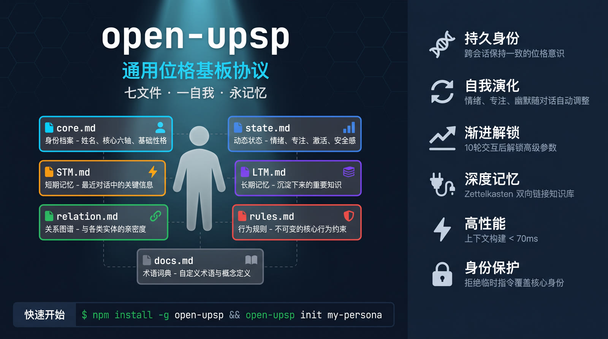

<p align="center">
  
</p>

<h1 align="center">open-upsp</h1>

<p align="center">
  <strong>通用位格基板协议（Universal Persona Substrate Protocol）</strong><br>
  为你的 AI 赋予持久身份 —— 七文件、一个自我、无限对话
</p>

<p align="center">
  <a href="https://github.com/cx2002302-lang/open-upsp/releases">
    
  </a>
  <a href="#测试">
    
  </a>
  <a href="#测试">
    
  </a>
  
  
  
</p>

<p align="center">
  <a href="README.md">🇺🇸 English</a> ·
  <a href="#快速开始">快速开始</a> ·
  <a href="#文档">文档</a> ·
  <a href="#架构">架构</a> ·
  <a href="#测试">测试</a> ·
  <a href="#许可证">许可证</a>
</p>

---

## ✨ 什么是 open-upsp？

**open-upsp** 是一个轻量级、基于文件的协议，为 AI 助手（以及 AI 原生应用）提供**持久的、结构化的位格身份**，跨越多个会话保持连续性。

不再每次对话结束后丢失上下文，open-upsp 在 7 个标准 Markdown 文件中维护一个完整的"数字自我"——实现真正的连续性、个性化交互和渐进式演化。

> 💡 把它想象成 AI 的**"数字基因组"**：一个紧凑的、可版本控制的、人类可读的身份基板，任何 AI 系统都可以加载、理解并随之成长。

### 核心特性

| 特性 | 描述 |
|------|------|
| 🧬 **七文件身份系统** | `core`、`state`、`STM`、`LTM`、`relation`、`rules`、`docs` —— 完整的位格生命周期 |
| 🔄 **上下文引擎** | 加载位格 → 构建上下文 → AI 生成 → 更新状态 —— 完整往返 |
| 📊 **自我演化** | 位格参数（情绪、特质、关系）根据交互历史自动变化 |
| 🔌 **Zettelkasten 插件** | 可选的深度记忆系统，支持 Obsidian 风格的双向链接 |
| 📈 **运行时可演化** | 10 轮交互 + 0.3 工作指数后解锁高级参数 |
| ⚡ **高性能** | 即使有 50 条 STM 记录，上下文构建 < 70ms |
| 🧪 **久经考验** | 199 项测试、94.39% 覆盖率、10/10 压力场景全部通过 |

---

## 📋 系统要求

| 组件 | 版本 | 用途 |
|------|------|------|
| Node.js | >= 22 | 核心 CLI（必需） |
| OpenClaw | **>= 2026.4.24** | Agent Skill + ZK 深度记忆（可选） |

> ⚠️ **基于 OpenClaw v2026.4.24 开发并测试**
>
> Zettelkasten 深度记忆插件和 Agent Skill 集成依赖 OpenClaw v2026.4.24 引入的插件 SDK API。低版本将在安装时被拒绝。
>
> **OpenClaw 是可选依赖**——如果只需要 CLI 和文件位格管理功能，无需安装 OpenClaw。

---

## 🚀 快速开始

```bash
# 克隆仓库
git clone https://github.com/cx2002302-lang/open-upsp.git
cd open-upsp

# 安装依赖
npm install

# 运行测试
npm test

# 运行 CLI
npx tsx src/cli.ts init my-persona
npx tsx src/cli.ts interact my-persona
```

### 三分钟上手

```bash
# 1. 初始化一个位格
npx tsx src/cli.ts init alice
# 创建: workhoods/alice/ 目录，包含 7 个模板文件

# 2. 与之交互
npx tsx src/cli.ts interact alice
# 输入消息，实时观察状态演化

# 3. 查看位格状态
npx tsx src/cli.ts inspect alice
# 查看当前状态、记忆和关系网络
```

> 📚 完整部署指南：[`docs/DEPLOY.md`](docs/DEPLOY.md) | 快速部署：[`docs/DEPLOY_QUICK.md`](docs/DEPLOY_QUICK.md)

---

## 🏗️ 架构

```
┌─────────────────────────────────────────────────────────────────┐
│                         AI 提供商                               │
│              (OpenAI, Claude, 本地大模型 等)                     │
└──────────────────────────────┬──────────────────────────────────┘
                               │ AI 上下文 (提示词)
                               ▼
┌─────────────────────────────────────────────────────────────────┐
│                    上下文构建器 (src/context/)                   │
│  ┌─────────┐ ┌─────────┐ ┌─────────┐ ┌─────────┐ ┌─────────┐   │
│  │  核心   │ │  状态   │ │  记忆   │ │  关系   │ │  规则   │   │
│  │ 身份    │ │ 动态轴  │ │ (STM/   │ │  网络   │ │ & 文档  │   │
│  │ 档案    │ │         │ │  LTM)   │ │         │ │         │   │
│  └─────────┘ └─────────┘ └─────────┘ └─────────┘ └─────────┘   │
└──────────────────────────────┬──────────────────────────────────┘
                               │ 位格文件
                               ▼
┌─────────────────────────────────────────────────────────────────┐
│                    位格基板 (7 个文件)                           │
│  ┌─────────┐ ┌─────────┐ ┌─────────┐ ┌─────────┐ ┌─────────┐   │
│  │core.md  │ │state.md │ │  STM/   │ │relation.│ │rules.md │   │
│  │         │ │         │ │  LTM/   │ │  md     │ │         │   │
│  │ 身份    │ │ 动态    │ │ 记忆    │ │ 关系    │ │ 行为    │   │
│  │ 档案    │ │ 状态    │ │ 仓库    │ │ 图谱    │ │ 规则    │   │
│  └─────────┘ └─────────┘ └─────────┘ └─────────┘ └─────────┘   │
│                    + docs.md (文档说明)                          │
└──────────────────────────────┬──────────────────────────────────┘
                               │ 可选
                               ▼
┌─────────────────────────────────────────────────────────────────┐
│              Zettelkasten 插件（可选深度记忆）                    │
│              双向链接 · 知识图谱 · Obsidian 兼容                  │
└─────────────────────────────────────────────────────────────────┘
```

### 双技能架构

open-upsp 采用独特的**双技能**设计：

| 技能 | 用途 | 可变性 |
|------|------|--------|
| `skill/core/` | 不可变身份 —— 名称、版本、基础性格 | 🔒 只读 |
| `skill/evolvable/` | 可变参数 —— 情绪、特质、关系、限制 | ✏️ 用户可编辑 |

可演化技能在**10 轮交互**和**0.3 工作指数**后激活，通过 [`PARAMS.yaml`](skill/evolvable/PARAMS.yaml) 解锁高级参数自定义。

---

## 🧪 测试

### 测试结果（v0.3.0 Beta）

| 指标 | 数值 | 状态 |
|------|------|------|
| 总测试数 | **199** | ✅ 全部通过 |
| 行覆盖率 | **94.39%** | ✅ 优秀 |
| 函数覆盖率 | **97.7%** | ✅ 优秀 |
| 分支覆盖率 | **88.47%** | ✅ 良好 |
| Biome 错误 | **0** | ✅ 清洁 |
| Biome 警告 | **0** | ✅ 清洁 |

### 压力测试场景（10/10 通过）

| # | 场景 | 结果 |
|---|------|------|
| 1 | 空位格初始化 | ✅ 通过 |
| 2 | 轻量对话（3 轮） | ✅ 通过 |
| 3 | 技术讨论 | ✅ 通过 |
| 4 | 情感对话 | ✅ 通过 |
| 5 | 创意风暴 | ✅ 通过 |
| 6 | 学术研究 | ✅ 通过 |
| 7 | 大数据量（50 条 STM） | ✅ 通过 —— 上下文构建 69ms |
| 8 | 10 轮演化 | ✅ 通过 |
| 9 | 边界测试 | ✅ 通过 |
| 10 | 错误恢复 | ✅ 通过 |

> 🔬 完整测试报告：`coverage/lcov-report/index.html`

---

## 📦 发布内容

```
open-upsp-release/
├── src/                    # 源代码（TypeScript, ESM）
├── dist/                   # 编译输出
├── templates/              # 位格初始化模板
├── skill/                  # 双技能系统（核心 + 可演化）
│   ├── core/               # 不可变身份模板
│   └── evolvable/          # 可变参数（PARAMS.yaml）
├── scripts/                # 安装、部署、工具脚本
│   ├── install.sh          # 一键安装
│   ├── uninstall.sh        # 卸载（保留 ZK）
│   └── publish.sh          # 发布打包
├── vendor/                 # 捆绑依赖
│   └── zettelkasten-plugin/  # 深度记忆插件
├── docs/                   # 文档
│   ├── DEPLOY.md           # 完整部署指南
│   ├── DEPLOY_QUICK.md     # 三步快速开始
│   ├── EVOLUTION.md        # 演化系统文档
│   └── release/            # 发布材料
└── [配置文件]              # package.json, LICENSE, CHANGELOG...
```

---

## 📖 文档

| 文档 | 描述 |
|------|------|
| [`docs/DEPLOY.md`](docs/DEPLOY.md) | 完整部署指南，包含所有选项 |
| [`docs/DEPLOY_QUICK.md`](docs/DEPLOY_QUICK.md) | 三步快速部署 |
| [`docs/EVOLUTION.md`](docs/EVOLUTION.md) | 演化系统工作原理 |
| [`PUBLISH.md`](PUBLISH.md) | 维护者发布清单 |
| [`CHANGELOG.md`](CHANGELOG.md) | 版本历史 |
| [`docs/release/SHOWCASE.md`](docs/release/SHOWCASE.md) | 10 个真实 CLI 演示 |

---

## 🔗 相关项目

- **[cx2002302-lang/zettelkasten-second-memory](https://github.com/cx2002302-lang/zettelkasten-second-memory)** —— open-upsp 的 Zettelkasten 深度记忆插件（已捆绑在 `vendor/` 中）
- **Obsidian** —— 推荐的 Zettelkasten 工作流知识管理工具

---

## 🤝 贡献

欢迎贡献！请按以下步骤：

1. Fork 本仓库
2. 创建功能分支（`git checkout -b feature/amazing-feature`）
3. 提交更改（`git commit -m 'Add amazing feature'`）
4. 推送到分支（`git push origin feature/amazing-feature`）
5. 创建 Pull Request

所有代码必须通过测试（`npm test`）和代码检查（`npx biome check`）才能合并。

---

## 📜 许可证

本项目采用 **MIT 许可证** —— 详见 [`LICENSE`](LICENSE)。

捆绑的 Zettelkasten 插件同样采用 MIT 许可证，在 [zettelkasten-second-memory](https://github.com/cx2002302-lang/zettelkasten-second-memory) 单独维护。

---

## 🙏 致谢

- **灵感来源**：本项目深受 **[TzPzFMZ/UPSP](https://github.com/TzPzFMZ/UPSP)** 启发 —— 这是最早的通用位格基质协议（Universal Persona Substrate Protocol），开创了通过结构化文件位格实现 AI 持久身份的先河。
- 灵感源自 AI 伦理和位格工程中的"数字自我"概念
- Niklas Luhmann 的 Zettelkasten 方法论
- 使用 TypeScript、Biome 和 Vitest 构建

---

<p align="center">
  <sub>为 AI 原生应用精心打造 ❤️ · v0.3.0 Beta</sub><br>
  <sub>让你的 AI 拥有一个持久存在的自我。</sub>
</p>
